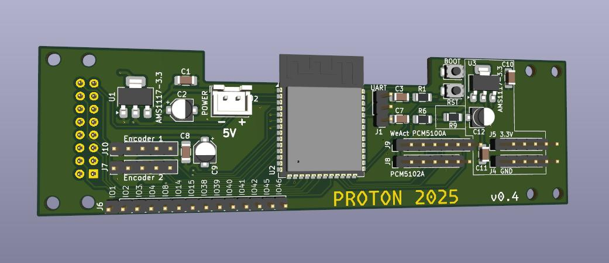

# YoRadio – Płytka PCB (v0.4) dla wyświetlacza SSD1322

Projekt sprzętowy płytki drukowanej (PCB) dla YoRadio. Repozytorium zawiera kompletny projekt KiCad oraz gotowe pliki produkcyjne (Gerbery + wiercenia), a także zrzuty ekranu i zdjęcia płytki.

Status: stabilna wersja v0.4 (zestaw plików produkcyjnych w katalogu YR_v0.4 oraz archiwum YR_v0.4.zip)

## Opis

- Projekt dwuwarstwowej płytki drukowanej dla YoRadio.
- Pliki KiCad pozwalają na edycję schematu i PCB oraz generowanie nowych wyjść produkcyjnych.
- Do repozytorium dołączone są zdjęcia i zrzuty ekranu z projektu, a także lista elementów (BOM).

Uwaga: Plik `myoptions_0.4.h` to nagłówek konfiguracyjny oprogramowania/firmware, dołączony pomocniczo. Nie jest wymagany do samej produkcji PCB.

## Zawartość repozytorium

Kluczowe pliki i katalogi:
- Projekt KiCad:
  - `YR.kicad_pro` – projekt KiCad
  - `YR.kicad_sch` – schemat
  - `YR.kicad_pcb` – płytka PCB
  - `schematic.pdf` – schemat w formacie PDF (podgląd bez KiCada)
- Produkcja (Gerber/Drill) – gotowe do wysyłki do fabryki:
  - Katalog: `YR_v0.4/`
  - Archiwum: `YR_v0.4.zip`
- Lista elementów (BOM):
  - `YR.csv`
- Modele/3D i grafika:
  - `YR.wrl` – model 3D (podgląd w KiCad 3D Viewer)
  - `img/` – zdjęcia i zrzuty ekranu (np. `PCB1.jpg`, `PCB2.jpg`)

Pozostałe:
- `YR.kicad_prl` – ustawienia sesji/projektu
- `myoptions_0.4.h` – plik konfiguracyjny firmware (pomocniczy)

## Wymagania i narzędzia

- KiCad 9

## Szybki start (KiCad)

1. Otwórz projekt: `YR.kicad_pro`.
2. Przejrzyj schemat: `YR.kicad_sch` (lub `schematic.pdf` jeśli nie masz KiCada).
3. Otwórz PCB: `YR.kicad_pcb` (sprawdź warstwy, reguły DRC).
4. Podgląd 3D (opcjonalnie): View → 3D Viewer (model `YR.wrl`).

## Pliki do produkcji (Gerber/Drill)

Gotowe do wysyłki do fabryki (wersja v0.4):
- Katalog: `YR_v0.4/`
- Archiwum: `YR_v0.4.zip` (zawiera te same pliki, wygodne do wgrania do wytwórni)

## Montaż (BOM, stencil)

- BOM: `YR.csv` – lista elementów do kompletacji.
- Stencil: jeżeli montaż SMD, użyj odpowiednich plików `*_Paste.gbr` do wykonania szablonu pasty.
- Uwaga: upewnij się co do orientacji elementów (diody, elektrolity, układy scalone) zgodnie ze znacznikami na warstwie opisowej.

## Programowanie układu ESP32

Układ ESP32 programuje się przy użyciu interfejsu USB - UART z napięciem 3.3V
Po podłączeniu interfejsu i zasilania do płytki, należy nacisnąć 2 przyciski, RST i BOOT, następnie zwolinić je w kolejności RST, następnie BOOT. Uruchomi się wtedy bootloader, który umożliwia zaprogramowanie układu bezpośrednio z Arduino IDE. 

## Licencja i zastrzeżenia

- Licencja: `GPL-3.0`

Miłego korzystania z projektu YoRadio PCB!
